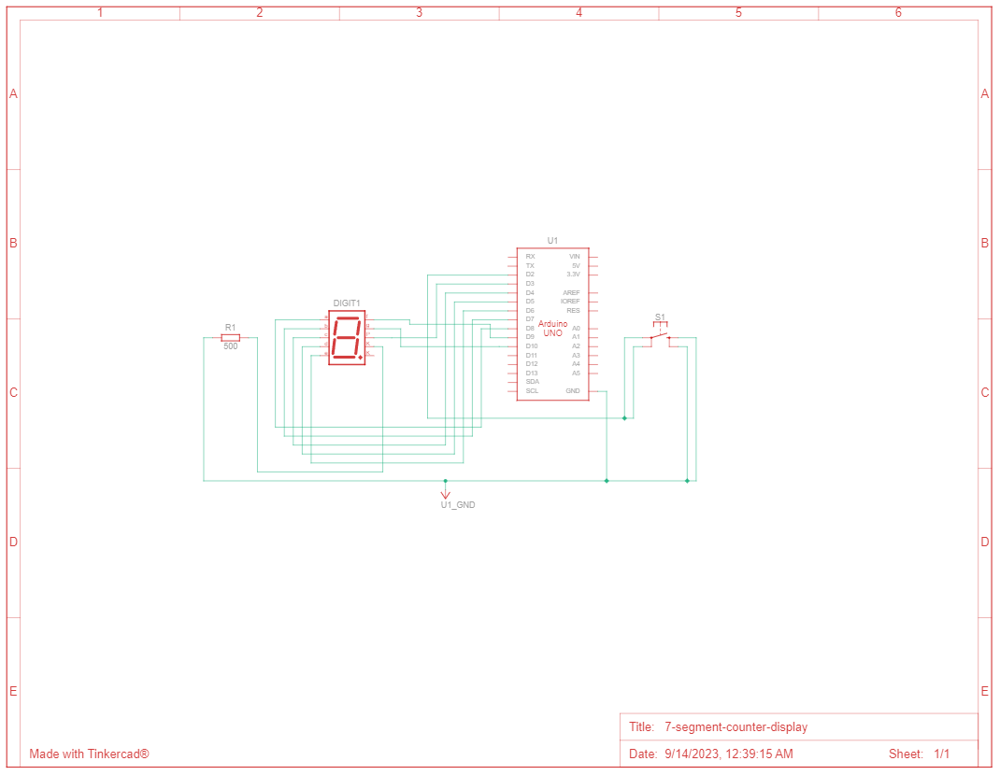
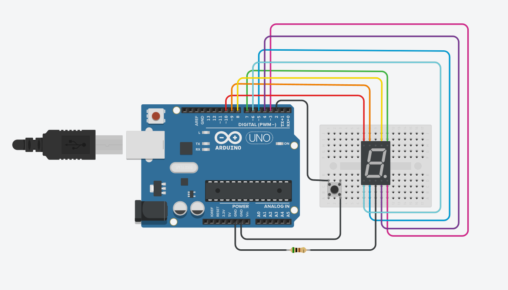

# 7 Segment Counter Display

Design a display that counts from 0 to 7, with a 1 second interval between numbers, every time a button is pressed. Use a 7-segment display to display the count.

## Components

|Name  |Quantity|Component                  |
|------|--------|---------------------------|
|U1    |1       | Arduino Uno R3            |
|R1    |1       | 500 Ω Resistor            |
|Digit1|1       | Cathode 7 Segment Display |
|S1    |1       | Pushbutton                |

## Simulation

Platform: [Tinkercad.com](https://www.tinkercad.com/).

| Schematic  | Circuit View |
|:----------:|:------------:|
|||